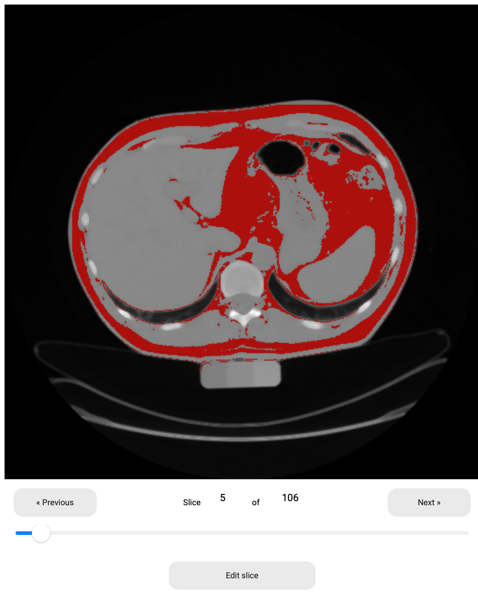
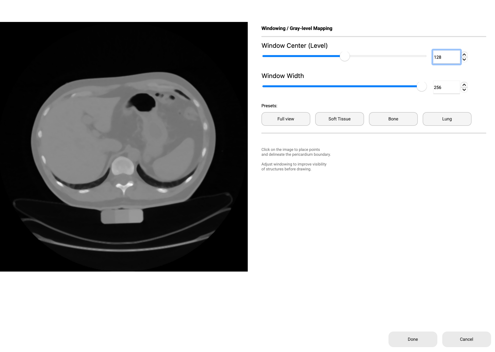

# HARTA - Epicardial Fat Segmentation and Quantification Software

HARTA is software developed in the context of a master thesis project.
- Rebelo, A. F. O. (2021). Semi-automatic approach for epicardial fat segmentation and quantification on non-contrast cardiac CT. Dissertation submitted in partial fulfillment of the requirements for the degree of Master of Science in Biomedical Engineering, NOVA University of Lisbon, NOVA School of Science and Technology.

This application comes as an answer to the time-consuming task of manually segmenting epicardial fat on CT images. The proposed algorithm uses exclusively basic image operations, so no training steps are required. This software must be seen as a prototype that can be upgraded and optimized with the community's suggestions.

Feel free to contact the original author: afo.rebelo@campus.fct.unl.pt


---

## Screenshots

**Main window — Slice slider navigation**


**Edit Slice window — Windowing / Gray-level Mapping panel**


---

## macOS Port — What's New

This fork ports HARTA to **macOS (Apple Silicon & Intel)** and adds several usability improvements over the original Windows-only release.

### Bug Fixes
| Issue | Fix |
|---|---|
| Crash on button click (PyQt5 5.15 `abort()` on slot exception) | Added `sys.excepthook` override — errors now show a dialog instead of crashing silently |
| `FileNotFoundError` when clicking Calculate Volume | Auto-create required directories (`aux_img/slices`, `contours`, `fat`, `combined`) on startup |
| Close button crash when `aux_img/` doesn't exist | `cleanAll()` now checks directory existence before iterating |

### New Features

#### Slice Slider
A **horizontal slider** below the CT image allows dragging through all slices instantly, instead of clicking Previous/Next repeatedly. The slider and navigation buttons stay in sync.

#### Windowing / Gray-level Mapping (Edit Slice window)
The pericardium delineation window now includes a full **windowing panel** on the right side:

- **Window Center (Level)** — slider + spinbox (0–255)
- **Window Width** — slider + spinbox (1–256)
- **4 Presets**: Full view · Soft Tissue · Bone · Lung
- Adjusting windowing does **not** erase contour points already drawn

#### Resized Edit Slice Window
The edit slice window is now **1050 × 750 px** (up from 860 × 920) so that Done and Cancel buttons are always fully visible and not hidden behind the OS taskbar or window chrome.

### macOS Installation (one-command setup)

```bash
git clone https://github.com/HarryTRAN207/Harta_MacOs
cd Harta_MacOs
bash install_macos.sh
./run_harta.sh
```

**Requirements:** macOS · Python 3.8–3.12 · Internet connection (first install only, ~300 MB)

---

## Getting Started (original — Windows)

1. Install Python 3.8.3
2. Add Python to Windows environment variables
3. Download and extract this repository
4. Open terminal in the folder and run:

```
pip install -r requirements.txt
python3 harta.py
```

## Input files

HARTA only accepts cardiac CT datasets in DICOM format (`.dcm`). Although it runs on contrast-enhanced images, HARTA is optimized for segmenting non-contrast images.

If you do not own any cardiac CT in DICOM format, you can use the public [Visual Lab - Cardiac Fat Database](https://visual.ic.uff.br/en/cardio/ctfat/).

## Version

| Version | Notes |
|---|---|
| 1.0.0 | Original release (Windows) — Rebelo, 2021 |
| 1.1.0 | macOS port with bug fixes, slice slider, windowing panel |

## License

HARTA follows the [CC-BY-NC-4.0 license](https://github.com/aforebelo/HARTA/blob/main/LICENSE), being freely available for academic or individual research purposes. Commercial use is restricted.

## Original Authors

Ana Filipa Rebelo

**Supervised by:**
- Prof. Dr. José Manuel Fonseca — NOVA School of Science and Technology, NOVA University of Lisbon

**With insights from:**
- Dr. António Miguel Ferreira — Cardiologist, Hospital Santa Cruz, Western Lisbon Hospital Center
